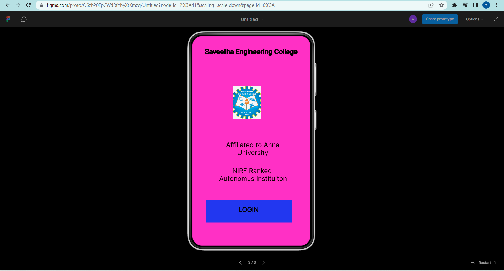
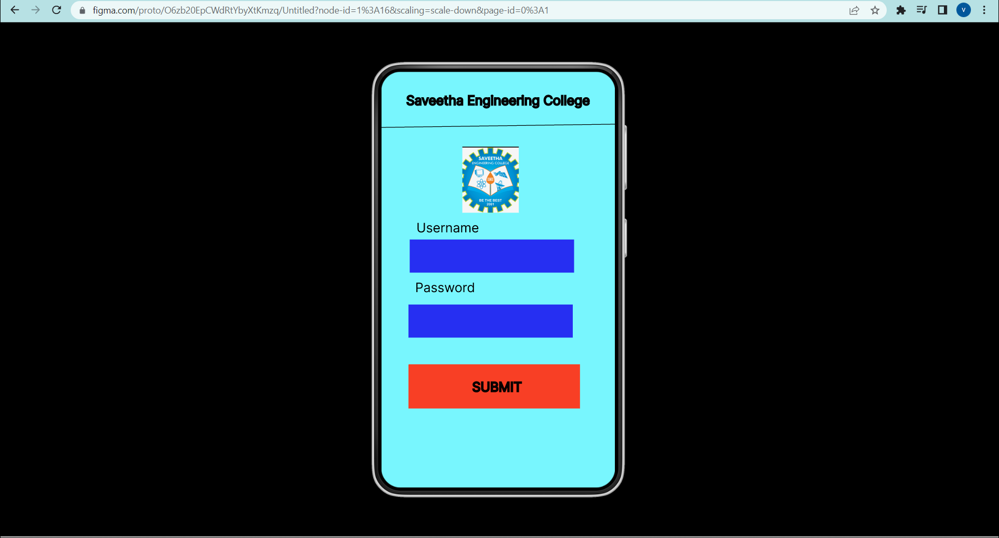
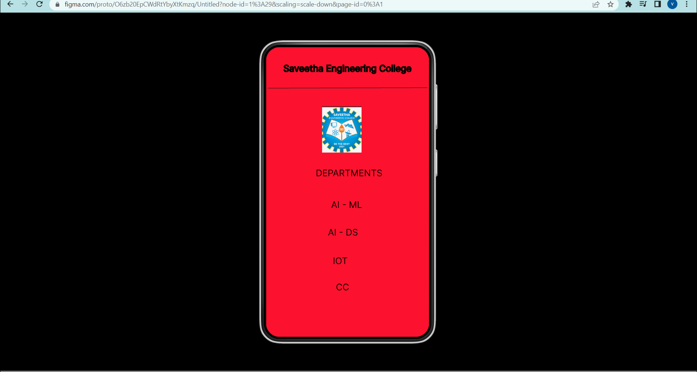

# Event Registration Web Application

## AIM:
To design, develop and deploy a web application for event registration.

## DESIGN STEPS:

### Step 1:
Create a new frame.

### Step 2:
Select any one preset size of your choice.

### Step 3:
Select the shapes you need.

### Step 4:
Import images as needed.

### Step 5:
Create pages based on your need and link them.

### Step 6:

Validate the HTML and CSS code.

### Step 6:

Publish the website in the given URL.

## DESIGN TOOL:
Figma

## code:
```
/* Home Page */


position: relative;
width: 360px;
height: 640px;
background: #FF30C5;

/* Login Page */


position: relative;
width: 360px;
height: 640px;
background: #78F6FE;

/* Saveetha Engineering College */
position: absolute;
width: 306px;
height: 56px;
left: 27px;
top: 35px;

font-family: 'Inter';
font-style: normal;
font-weight: 400;
font-size: 20px;
line-height: 24px;
text-align: center;
color: #080404;
border: 1px solid #000000;

/* DEPARTMENTS */
position: absolute;
width: 299px;
height: 54px;
left: 34px;
top: 266px;
font-family: 'Inter';
font-style: normal;
font-weight: 400;
font-size: 20px;
line-height: 24px;
text-align: center;
color: #150101;

/* AI - ML */
position: absolute;
width: 282px;
height: 53px;
left: 37px;
top: 336px;
font-family: 'Inter';
font-style: normal;
font-weight: 400;
font-size: 20px;
line-height: 24px;
text-align: center;
color: #130101;


/* AI-DS */
position: absolute;
width: 268px;
height: 46px;
left: 36px;
top: 397px;
font-family: 'Inter';
font-style: normal;
font-weight: 400;
font-size: 20px;
line-height: 24px;
text-align: center;
color: #0A0808;

/* IOT */
position: absolute;
width: 260px;
height: 45px;
left: 34px;
top: 460px;
font-family: 'Inter';
font-style: normal;
font-weight: 400;
font-size: 20px;
line-height: 24px;
text-align: center;
color: #190000;


/* CC */
position: absolute;
width: 270px;
height: 43px;
left: 34px;
top: 518px;
font-family: 'Inter';
font-style: normal;
font-weight: 400;
font-size: 20px;
line-height: 24px;
text-align: center;
color: #100101;


/* Line 3 */
position: absolute;
width: 360px;
height: 0px;
left: 0px;
top: 83px;
border: 4px solid #172DF5;

/* Logo 3 */
position: absolute;
width: 87px;
height: 102px;
left: 124px;
top: 131px;
background: url(logo.png);

## OUTPUT:




## RESULT:
The program to design, develop and deploy a web application for event registration is completed successfully.